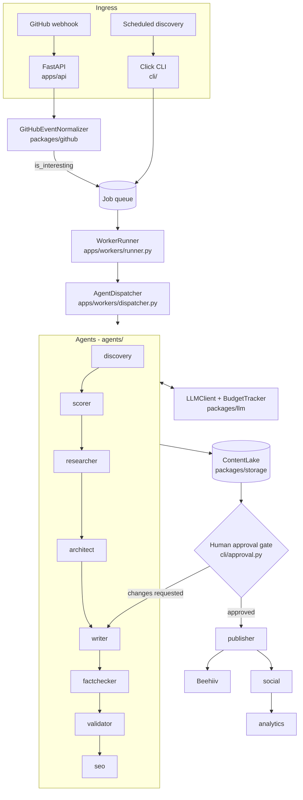

# Architecture

## What this system does

Turns engineering events (GitHub pushes, releases, scheduled scans) into
researched, fact-checked, human-approved articles published to Beehiiv.

## Shape

## Layers

| Layer | Path | Responsibility |
| --- | --- | --- |
| Contracts | `packages/schemas/` | Pydantic models. Every payload crossing a boundary is validated here |
| Agents | `agents/` | One editorial step each; stateless (ADR [0002](adr/0002-stateless-agents-with-job-contracts.md)) |
| Orchestration | `apps/workers/` | Dispatch, retry, dead-letter, pipeline sequencing |
| Interfaces | `apps/api/`, `cli/` | HTTP surface and terminal surface over the same core |
| Integrations | `packages/github/`, `packages/beehiiv/`, `packages/llm/` | Outbound clients |
| Storage | `packages/storage/` | Content lake, local or S3 (ADR [0003](adr/0003-content-lake-storage-abstraction.md)) |
| Observability | `packages/observability/` | Per-article cost accounting |

## Invariants

These hold across the system. Breaking one is a defect, not a style choice.

1. **Agents are stateless.** All context arrives in a `JobContract`. An agent
   that needs memory between jobs is a design error.
2. **Untrusted input never reaches a path.** Article and source ids come from
   webhooks and CLI arguments; every filesystem write goes through
   `ContentLake._resolve_safe_path`.
3. **No article publishes without a human.** The approval gate is not
   automatable. `ArticleStatus.APPROVED` is only ever set by a person.
4. **Every LLM call is metered.** `ArticleBudgetTracker` raises
   `BudgetExceededError` past the per-article ceiling.
5. **Provider failure degrades, it does not crash.** `LLMClient` falls back to
   offline generation and logs a warning.

## Costs and failure modes

- **Cost is per article**, capped by `MAX_LLM_COST_PER_ARTICLE`. The scorer
  gates expensive downstream work behind `AUTO_RESEARCH_SCORE_THRESHOLD` so
  low-value ideas never reach the researcher or writer.
- **Retries** are bounded by `JobContract.max_attempts`; exhausted jobs become
  `DEAD_LETTER` rather than looping.
- **Known reliability gaps** are tracked in [backlog.md](backlog.md).

## Environments

| | Local | Production |
| --- | --- | --- |
| Storage | `./content/` | S3 (`EDGE_ENV=prod` + `S3_CONTENT_BUCKET`) |
| Secrets | `.env` | AWS Secrets Manager |
| Compute | `make dev` | ECS Fargate (`infrastructure/terraform/`) |
| Queue | local file | SQS |
